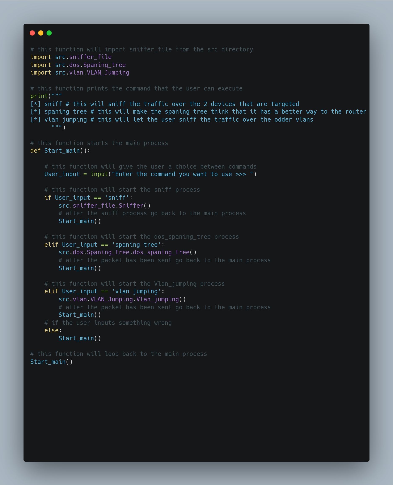

# Net-Sync

Net-Sync is an open-source network testing tool for ethical hacking. 

- Net-Sync is based on Scapy.  
- Sniff and collect packets over a network. 
- DOS spaning tree via Net-Sync.
- VLAN Jumping via Net-Sync.
- And meny more.

## Install Net-Sync

first we need to install scapy and to do this manually use the following command
```bash
pip install scapy
```

to clone the repository we need to use the following command
```bash
git clone https://github.com/nicolaypm/Net-Sync.git
```

cd to the directory Net-Sync
```bash
cd Net-Sync
```

start the program alle we need to do is run the following command
```bash
sudo python3 main.py
```
## Usage
- to sniff and collect packets over a network. we to Enter the sniff option and then specify how many packets we want to collect.
- DOS Spaning Tree, we need to Enter the Spaning Tree option and then specify the MAC address of the Spaning Tree
- VLAN Jumping, this will let the attacker see the traffic over odder VLANs. 
## Contributing
Pull requsts are welcome. For major changes, please open issue first to discuss what you would like to change.

Please make sure to update tests as appropriate.

## Code
**main.py**

## License
thenerds.xyz
